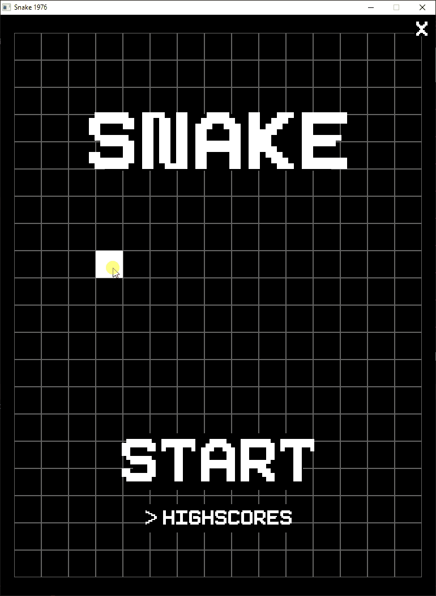

# Snake1976
- The classic snake game made in c++ using KoRRA
- 1 of 5 in my classic remake project.
- Simply put this is the old classic snake game. Remade using my own c++ engine.
- I'm using this game to solidify features for the KoRRA engine

## Latest Build Features
| Features  |              Media              |
|:---------:|:-------------------------------:|
|  Scenes   |     |
|  Scores   |      |
| Teleports |  |
-----------
## Previous Build Features

|      Features      |            Media             |
|:------------------:|:----------------------------:|
|      Buttons       |  |
| Grid Interactables |    |
|    Memory Leaks    |    |
-----------
